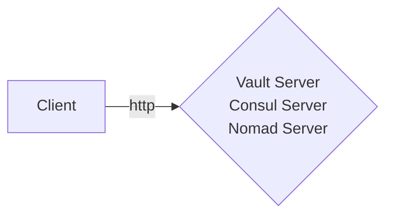
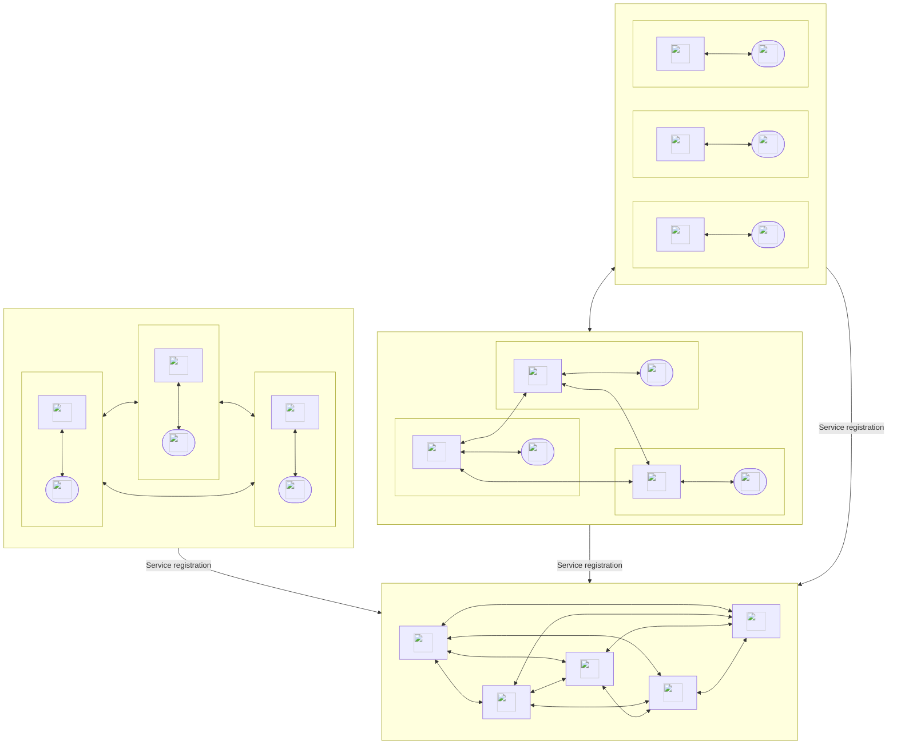

# Architecture Guide

Hashistack-Ansible offers flexibility in deploying various environments, whether for development, testing, or production. This guide will help you understand the different architectures you can deploy with Hashistack-Ansible.

## Dev/Testing Deployment

If you're setting up a test environment, you can deploy each service on a single host. Here’s an example of a minimal inventory file:

```ini
[vault_servers]
test-server

[consul_servers]
test-server

[nomad_servers]
test-server

[nomad_clients]
test-server

[consul_agents]
```

In this setup, each service runs on a single host with no clustering and no redundancy. **This configuration is ONLY recommended for testing** as it provides no resiliency and will fail if any component goes down.

### Requirements

The only requirement for this setup is that the target host must have a network interface accessible via SSH from the deployment host.

### Dev/Testing Architecture

The architecture for this test setup looks like this:



## Production Deployment

For production environments, it’s crucial to separate concerns and deploy services on different nodes. This ensures high availability and fault tolerance.

### Recommended Setup

- **Consul Servers:** An odd number (3 to 5) of nodes.
- **Vault Servers:** An odd number (3 to 5) of nodes.
- **Nomad Servers:** An odd number (3 to 5) of nodes.

A production-ready inventory file might look like this:

```ini
[vault_servers]
vaultnode1
vaultnode2
vaultnode3

[consul_servers]
consulnode1
consulnode2
consulnode3

[nomad_servers]
nomadnode1
nomadnode2
nomadnode3

[nomad_clients]
nomadclient1
nomadclient2
nomadclient3

[consul_agents]
...
```

### Production Architecture Diagram

Here’s what the architecture for a production setup might look like:


