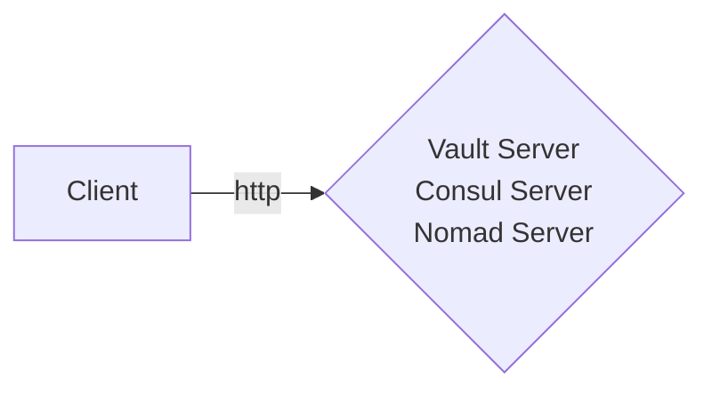
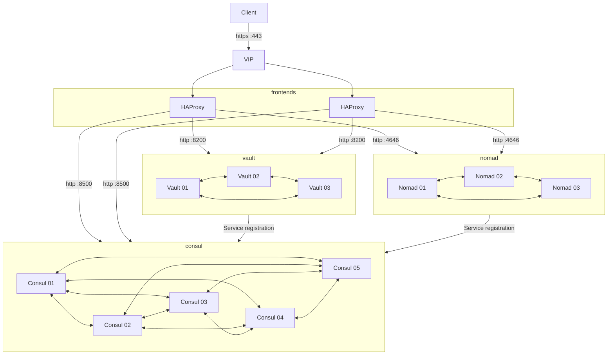

# Architecture Guide

Hashistack-Ansible allows you to deploy a number of architecture, wether you want to deploy a dev, testing, or production environment. These different architectures are described in this section.

## Dev deployment

If you only want to deploy a test environment, you can simply add a simgle host to each service that you want to deploy.

```ini
[haproxy_servers]

[vault_servers]
test01

[consul_servers]
test01

[nomad_servers]
test01
```

In this example, you will end end with each service running on a single host, with no clustering, and no redundancy. This setup *IS NOT RECOMMENDED** for anything but testing purposes, as it provides zero resiliency, and will break if anything goes down.

For this setup, the only requirement is for the target host to have a network interface that you can ssh into from the deployment host.

The architecture would like something like this:



## Testing/Preprod deployment

## Production deployment

For production use, it is recommended to separate concerns as much as possible. This means that consul, vault and nomad, as well as the haproxy services, should be on different nodes altogether. The **client-facing** and **cluster-facing** interfaces should also be separated.

Ideally, you would need:
  - an odd number (3 to 5) of consul servers
  - an odd number (3 to 5) of vault servers
  - an odd number (3 to 5) of nomad servers
  - multiple (2 to 3) haproxy servers

The **nomad**, **vault** and **consul** servers should have **two network interfaces**, and one of them should be reachable from the haproxy nodes.

The architecture for this infrastructure would look like:


